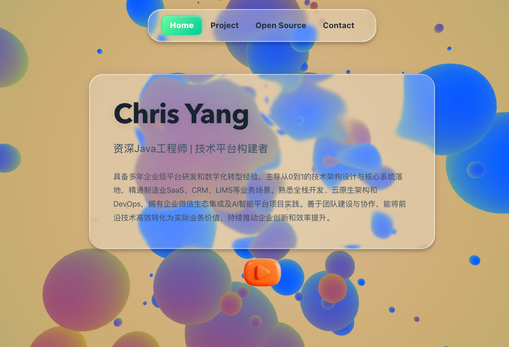
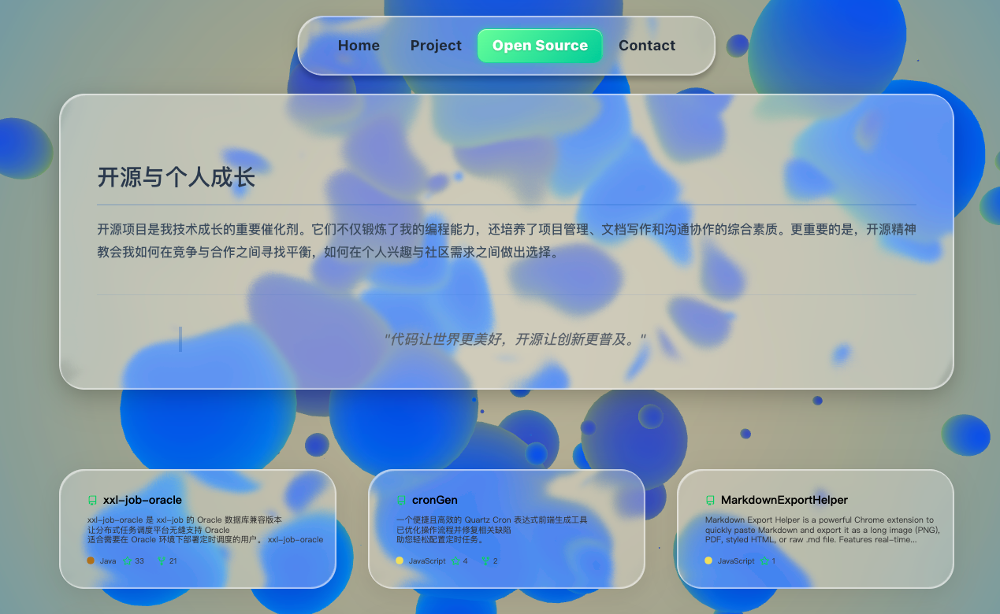
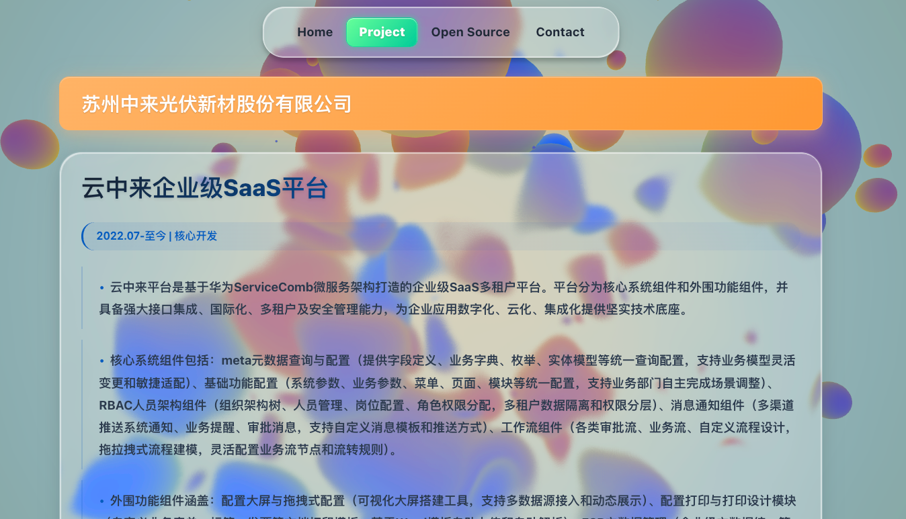
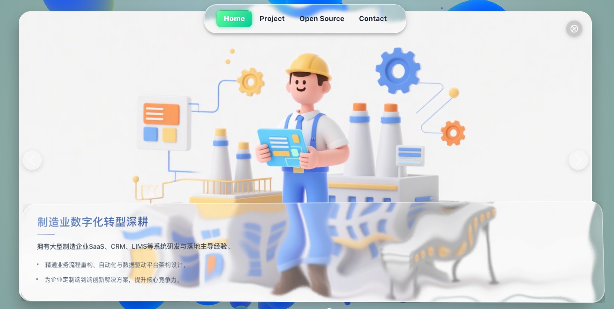

<div align="center">

**[English](#-english-guide) | [中文](#-chinese-guide)**

</div>

---

## 📖 English Guide

### 🚀 Quick Start: 3 Steps to Build Your Website (No Coding Needed)

This guide is for users who are not familiar with programming and want to set up their website in the fastest way possible.

#### Step 1: Download the Pre-built Package

1.  Go to the [**GitHub Releases**](https://github.com/Gigass/configurable-resume-website-liquid-glass/releases) page of this project.
2.  Download the `dist.zip` file from the latest release (V1.0 or newer).
3.  Unzip the `dist.zip` file on your computer. You will get a folder named `dist`.

#### Step 2: Customize Your Information

All content on your website is controlled by a single file. You only need to edit this one file.

1.  Inside the unzipped `dist` folder, find and open the file at this path: `data/sitedata.json`.
2.  **(Recommended)** To quickly generate your personal information, visit the [AI Resume-to-JSON Converter](https://www.coze.cn/store/agent/7533541654746546211?bot_id=true), upload your resume, and the AI will automatically generate the required `json` content. Copy all the generated code.
3.  **Completely replace** all the original content in the `sitedata.json` file with your own `json` content, then save the file.

#### Step 3: Publish Your Website

The `dist` folder now contains your personalized website.

1.  Upload **all the files inside** the `dist` folder (not the `dist` folder itself) to any static website hosting service.
2.  Recommended free services include [Netlify](https://www.netlify.com/), [Vercel](https://vercel.com/), and [GitHub Pages](https://pages.github.com/). You can typically just drag and drop the files to publish them.

Congratulations! Your personal portfolio website is now live!

---

### 🛠️ Developer Guide (For Customization)

This guide is for users who want to clone the source code for further development or deep customization.

#### ✨ Core Features

-   **Fully Responsive**: Adapts seamlessly to various screen sizes, from large desktop monitors to mobile phones.
-   **Liquid Glass UI**: A unique and visually appealing user interface with a frosted glass effect.
-   **Data-Driven**: All site content is dynamically loaded from `sitedata.json`, making updates easy.
-   **Interactive Experience**: Features smooth page transitions, animated carousels, and interactive cards.
-   **Modern Tech Stack**: Built with Vue 3 (Composition API), Vite, and TypeScript.

#### 🖼️ Screenshots

| Home Page                                                          | Open Source Projects                                                       |
| :----------------------------------------------------------------- | :------------------------------------------------------------------------- |
|          |  |
| **Portfolio**                                                      | **Full-Screen Carousel**                                                   |
|  |                |

#### 🔧 Project Setup

**Prerequisites:**

-   [Node.js](https://nodejs.org/) (v18.x or higher recommended)
-   [npm](https://www.npmjs.com/) or [yarn](https://yarnpkg.com/)

**Installation:**

1.  Clone the repository:
    ```sh
    git clone https://github.com/Gigass/configurable-resume-website-liquid-glass.git
    ```
2.  Navigate to the project directory:
    ```sh
    cd configurable-resume-website-liquid-glass
    ```
3.  Install dependencies:
    ```sh
    npm install
    ```

**Development Server:**

Run a local development server with hot-reloading:
```sh
npm run dev
```
The application will be available at `http://localhost:5173`.

**Build for Production:**

Compile and minify the application for production:
```sh
npm run build
```
The output files will be located in the `dist/` directory.

<br>
<br>

---

## 📖 中文指南

### 🚀 快速上手：三步搭建您的网站 (无需编程)

本指南适用于不熟悉编程、希望最快速搭建网站的用户。

### 第一步：下载预构建包

1.  访问本项目的 [**GitHub Releases 页面**](https://github.com/Gigass/configurable-resume-website-liquid-glass/releases)。
2.  下载最新版本 (V1.0 或更高) 下的 `dist.zip` 文件。
3.  在您的电脑上解压这个 `dist.zip` 文件，您会得到一个名为 `dist` 的文件夹。

### 第二步：修改个人信息

您网站的所有内容都由一个文件控制，您只需修改这一个文件即可。

1.  在解压后的 `dist` 文件夹中，找到并打开路径为 `data/sitedata.json` 的文件。
2.  **(推荐)** 为了快速生成您自己的信息，请访问 [AI简历信息生成器](https://www.coze.cn/store/agent/7533541654746546211?bot_id=true)，上传您的简历，AI会自动生成`json`内容。复制所有生成的内容。
3.  将您准备好的 `json` 内容，**完全替换** `sitedata.json` 文件中原有的所有内容，然后保存文件。

### 第三步：发布您的网站

现在，`dist` 文件夹里已经是您自己的定制化网站了。

1.  将 `dist` 文件夹内的 **所有文件** (而不是 `dist` 文件夹本身) 上传到任何静态网站托管服务。
2.  推荐的服务有 [Netlify](https://www.netlify.com/), [Vercel](https://vercel.com/), [GitHub Pages](https://pages.github.com/) 等，它们通常提供免费的托管计划，您只需将文件拖拽上去即可完成发布。

恭喜！您的个人网站已经成功上线！

---

### 🛠️ 开发者指南 (深入定制)

本指南适用于希望克隆源码、进行二次开发或深入定制的用户。

#### ✨ 核心特性

-   **完全响应式**: 无缝适配各种屏幕尺寸，从大屏桌面到移动电话。
-   **液态玻璃UI**: 独特且富有视觉吸引力的毛玻璃质感界面。
-   **数据驱动**: 网站内容由 `sitedata.json` 文件动态加载，方便更新。
-   **沉浸式交互**: 拥有平滑的页面过渡、动画轮播图和交互式卡片。
-   **现代化技术栈**: 基于最新的网络技术构建，包括 Vue 3 (组合式 API), Vite, 和 TypeScript。

#### 🖼️ 项目截图

| 首页                                                               | 开源项目                                                           |
| :----------------------------------------------------------------- | :----------------------------------------------------------------- |
|          |  |
| **作品集**                                                         | **全屏轮播**                                                       |
|  |        |


#### 🔧 环境要求

-   [Node.js](https://nodejs.org/) (推荐 18.x 或更高版本)
-   [npm](https://www.npmjs.com/) 或 [yarn](https://yarnpkg.com/)

#### 🔧 安装

1.  克隆仓库:
    ```sh
    git clone https://github.com/Gigass/configurable-resume-website-liquid-glass.git
    ```
2.  进入项目目录:
    ```sh
    cd configurable-resume-website-liquid-glass
    ```
3.  安装依赖:
    ```sh
    npm install
    ```

#### 🔧 本地开发

启动一个支持热重载的本地开发服务器:
```sh
npm run dev
```
应用将在 `http://localhost:5173` 上可用。

#### 🔧 打包构建

编译和压缩应用以用于生产环境:
```sh
npm run build
```
输出的文件将位于 `dist/` 目录中。
