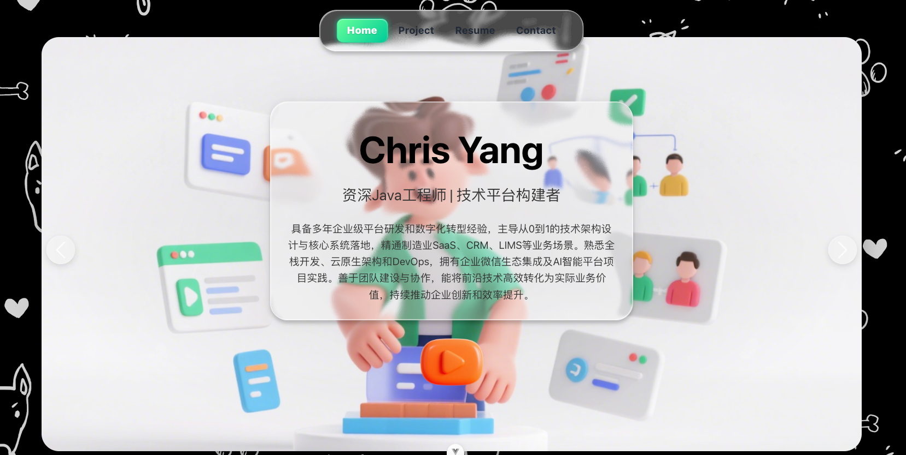
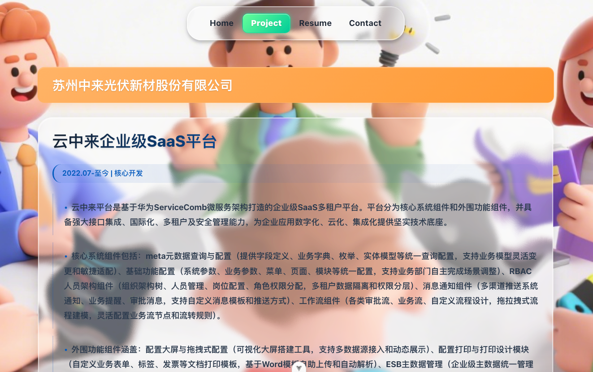

# Chris Yang - 动态交互式个人作品集

## 简介

这是一个基于 **Vue 3**, **Vite** 和 **TypeScript** 构建的高度动态化、交互式的个人作品集网站。本网站旨在通过现代前端技术和卓越的视觉设计，全面展示我的专业技能、项目经验和个人优势。

网站不仅仅是信息的静态陈列，更是一个充满高级动画、液态玻璃质感和微交互的沉浸式体验平台，旨在为访问者带来深刻的第一印象。


---

## ✨ 核心功能

### 1. **首页沉浸式体验 (`Home`)**



- **液态玻璃英雄区**: 首屏采用独特的液态玻璃（Liquid Glass）效果，结合动态光影和背景模糊，创造出引人注目的视觉焦点。
- **交互式引导**: 通过一个带有脉冲动画的播放按钮，引导用户开启一场交互式的个人优势探索之旅。
- **卡片式轮播 (`Swiper.js`)**: 以轮播图形式展示8大核心优势，每张卡片都配有高清背景图和动态文字。
- **Ken Burns 特效**: 轮播图背景采用经典的 Ken Burns 缩放平移特效，为静态图片注入生命力。
- **动态文本卡片**: 轮播图下方的文本卡片同样应用了液态玻璃效果，并在展开时带有优雅的 `clip-path` 裁剪动画和内容交错入场动画。

### 2. **项目作品集 (`Project`)**



- **动态网格布局**: 使用 CSS Grid 布局，支持不同大小的卡片，实现主次分明的项目陈列。
- **大卡片焦点展示**: 核心项目（如“云中来企业级SaaS平台”）将占据整行宽度，提供更详尽的信息展示空间。
- **高级卡片设计**:
    - **视觉层次**: 通过渐变文字、带状元信息、列表装饰线等设计元素，构建了清晰的视觉层次。
    - **3D悬停效果**: 鼠标悬停在卡片上时，会触发基于 `perspective` 的3D倾斜和拉近效果，增强了交互的趣味性。
    - **光泽和阴影**: 精心设计的标签悬停光泽效果和多层卡片阴影，提升了整体的精致感和高级感。
- **交错入场动画**: 项目卡片使用 `Intersection Observer API` 监听可见性，实现滚动时逐个、交错进入的动画效果，避免了页面的单调。

### 3. **统一的视觉语言与设计系统**
- **液态玻璃 (Liquid Glass)**: 作为核心视觉元素，贯穿于导航栏、英雄区域、信息卡片等多个模块，形成了统一、连贯的设计语言。
- **色彩系统**: 以科技蓝、活力橙和专业灰为主色调，并搭配渐变色，营造出现代、专业的品牌形象。
- **响应式设计**: 完美适配桌面、平板和移动设备，确保在任何屏幕尺寸下都有一致的优质体验。

### 4. **高性能实现**
- **Vite 驱动**: 基于 Vite 的开发和构建流程，享受毫秒级的热更新和高效的打包优化。
- **性能优化**:
    - 通过 `will-change` 和 `transform: translateZ(0)` 提示浏览器为动画元素创建独立的合成层，减少重绘和重排。
    - 解决了 `background-attachment: fixed` 在复杂页面滚动时导致的闪烁问题，提升了滚动性能。
    - 懒加载路由组件，优化初始加载速度。

---

## 🛠️ 技术栈与实现细节

### **核心技术**
- **框架**: Vue 3 (Composition API & `<script setup>`)
- **构建工具**: Vite
- **语言**: TypeScript
- **路由**: Vue Router
- **UI库/插件**: Swiper.js

### **技术实现深度解析**

#### **1. 液态玻璃 (Liquid Glass) 效果**
这个效果是网站的视觉核心，其实现结合了 SVG 滤镜和 CSS 的 `backdrop-filter`：
- **`SVG <filter>`**: 在 `App.vue` 中定义了一个全局的SVG滤镜 (`#glass-distortion-global`)。
    - **`feTurbulence`**: 生成分形噪声（Fractal Noise），模拟玻璃材质的不规则折射纹理。
    - **`feDisplacementMap`**: 使用噪声纹理作为位移图，对元素进行像素级的扭曲，创造出液体流动的视觉假象。
- **`backdrop-filter: blur(3px)`**: 对元素背后的内容进行模糊处理，模拟毛玻璃效果。
- **光影与色调**: 通过多个叠加层（`.liquidGlass-tint`, `.liquidGlass-shine`）添加色调和高光，增加玻璃的真实感和立体感。

```css
.liquidGlass-effect {
  position: absolute;
  inset: 0;
  backdrop-filter: blur(3px);
  filter: url(#glass-distortion-global);
  /* ... */
}
```

#### **2. 动画系统**
- **入场动画 (`Intersection Observer`)**: `PortfolioView.vue` 中的 `v-stagger` 自定义指令利用 `Intersection Observer API` 监听 `.card-wrapper` 元素是否进入视口。一旦进入，就为其内部的 `.project-card` 添加 `.is-visible` 类，触发预设的 `clip-path` 动画。这种方式性能极高，因为它避免了监听 `scroll` 事件。
- **圆形揭露 (`clip-path`)**: 许多元素的入场动画（如英雄区、项目卡片）都使用了 `clip-path: circle(...)`。通过将 `circle()` 的半径从 `0%` 过渡到 `75%` (或更大)，实现了优雅的圆形揭露动画，比传统的 `width`/`height` 动画性能更好、效果更佳。
- **3D 变换 (`transform`)**: 项目卡片的悬停效果使用了 `transform: perspective(...) rotateX(...) rotateY(...)` 来创建3D空间感，让卡片看起来像是浮动在页面之上。

#### **3. 组件化结构**
- **`App.vue`**: 根组件。负责渲染全局布局（如固定头部的导航栏）和 `RouterView`。全局的 SVG 滤镜也在此定义。
- **`HomeView.vue`**: 首页。管理复杂的交互状态（如介绍是否开始），并控制英雄区和轮播图的切换与动画。
- **`PortfolioView.vue`**: 项目页。负责渲染项目数据，并管理项目卡片的网格布局和交错动画。
- **`ResumeView.vue`**: 简历页。用于展示个人履历。
- **`ContactView.vue`**: 联系页。提供联系方式。

---

## 🚀 本地运行与部署

### **环境要求**
- Node.js >= 16.x
- npm / pnpm / yarn

### **安装依赖**
```bash
npm install
```

### **开发模式**
运行以下命令，启动本地开发服务器。服务将在 `http://localhost:5173` (或其他可用端口) 上可用，并支持热模块替换 (HMR)。
```bash
npm run dev
```

### **生产构建**
将项目打包为用于生产环境的静态文件，输出目录为 `dist`。
```bash
npm run build
```

### **预览生产版本**
在本地启动一个静态文件服务器，预览 `dist` 目录中的生产版本。
```bash
npm run preview
```

---
## 📁 项目结构
```
mywebsite/
├── public/                  # 静态资源
├── src/
│   ├── assets/              # CSS, 图片, 字体等资源
│   ├── components/          # 可复用Vue组件
│   ├── router/              # Vue Router 路由配置
│   │   └── index.ts
│   ├── stores/              # Pinia 状态管理 (如果使用)
│   ├── views/               # 页面级组件
│   │   ├── HomeView.vue
│   │   ├── PortfolioView.vue
│   │   ├── ResumeView.vue
│   │   └── ContactView.vue
│   ├── App.vue              # 根组件
│   └── main.ts              # 应用入口文件
├── index.html               # HTML 入口
├── package.json             # 项目依赖与脚本
├── tsconfig.json            # TypeScript 配置文件
└── vite.config.ts           # Vite 配置文件
```
